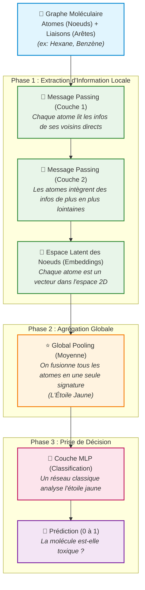

# Architecture Pédagogique d'un GNN

Ce schéma illustre la structure classique d'un Graph Neural Network (comme celui codé dans notre tableau de bord interactif) pour une tâche de classification de molécules.

### Comment lier ce schéma au Dashboard ?
1. **Graphe Moléculaire** ➔ Le graphique de gauche.
2. **Phase 1 (Message Passing)** ➔ Ce sont les itérations d'entraînement (quand tu appuies sur "Step") qui mettent à jour l'espace latent au centre.
3. **Phase 2 (Pooling)** ➔ L'apparition de l'étoile jaune au centre du nuage de points.
4. **Phase 3 (MLP)** ➔ Le tracé de la ligne de décision (pointillée rouge) qui sépare l'espace en zone toxique/sûre.
